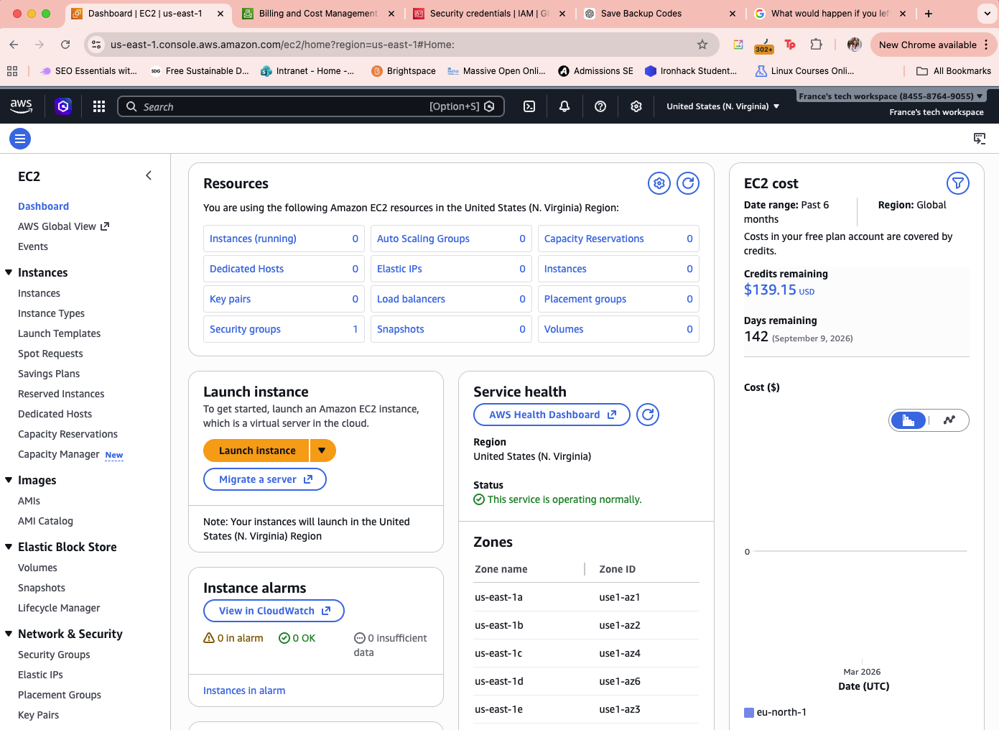
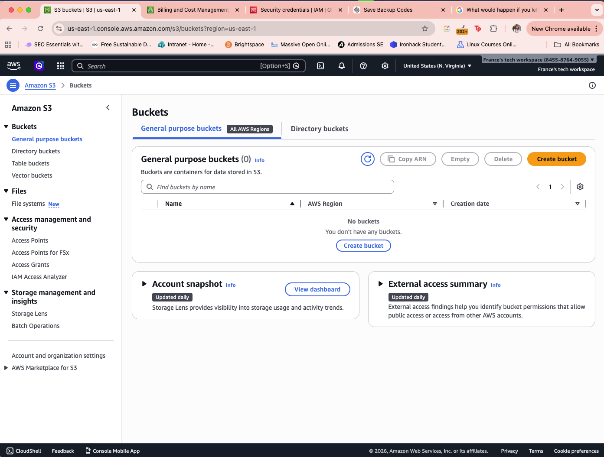
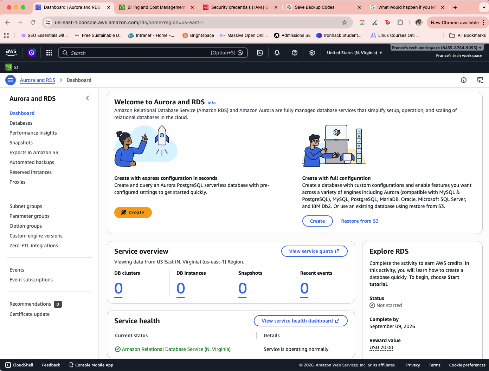
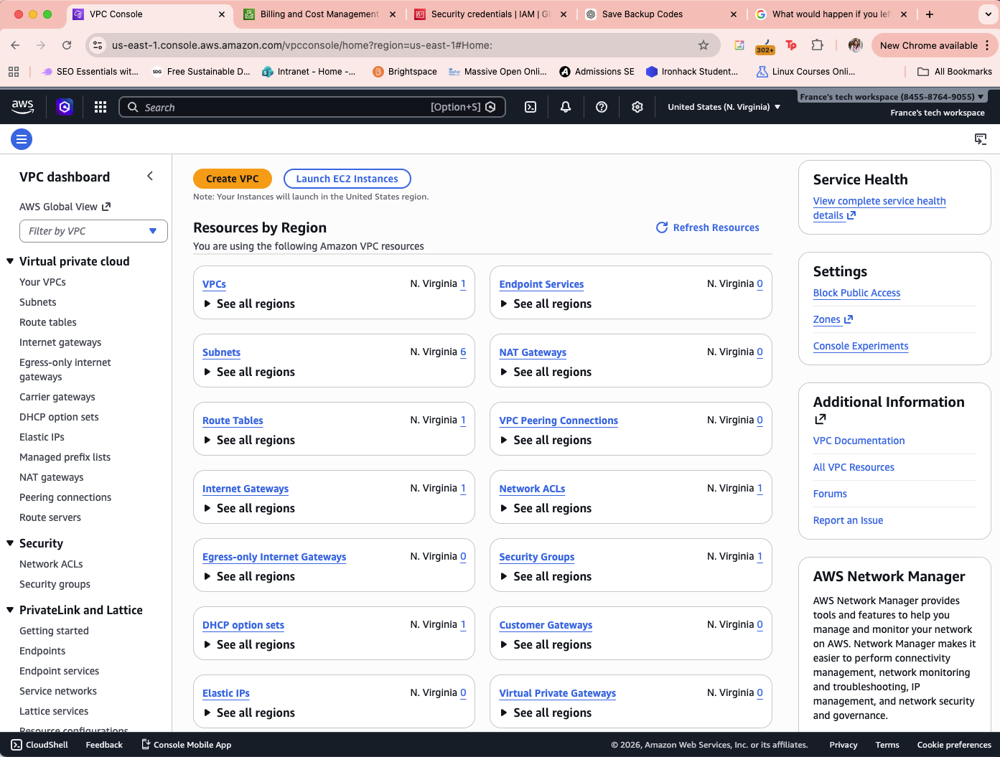
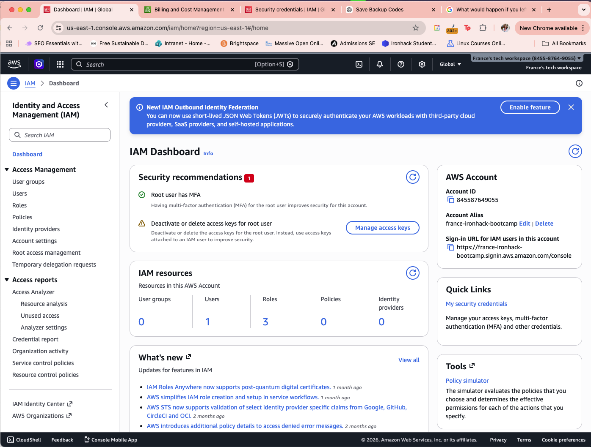
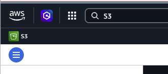
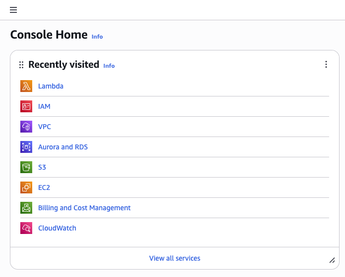
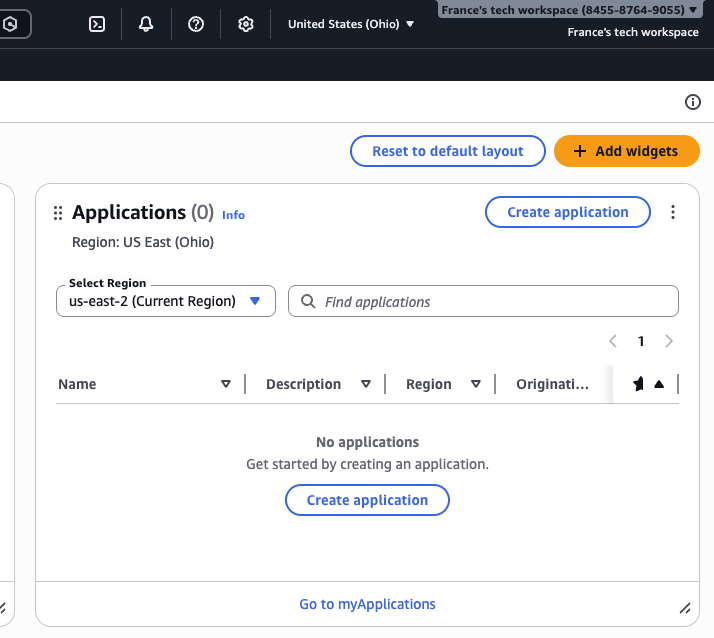
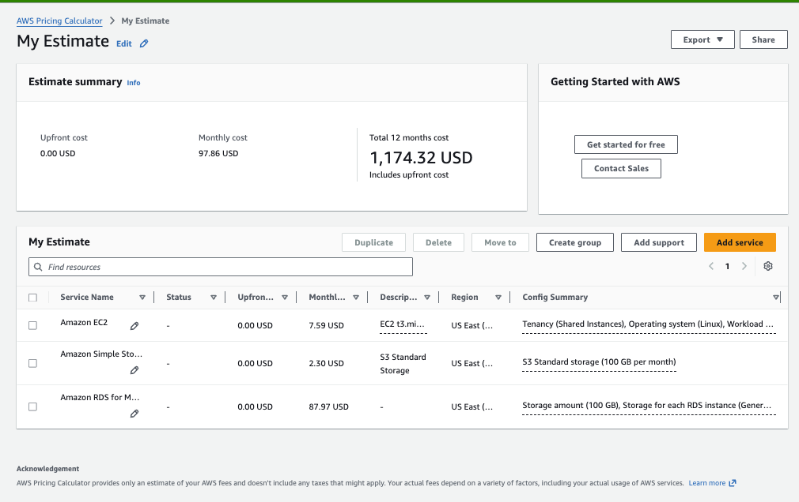

# Exploring AWS Services Lab - Solution

**Student Name:** [Your Name]  
**Date Completed:** [Date]

---

## Exercise 1: Console Navigation

### Part A: Service Discovery

**EC2 (Compute):**
- Purpose: [It provides scalable virtual servers. The most common uses are for hosting applications, development and testing, batch processing, high performance computing and gaming.]
- Screenshot: 

**S3 (Storage):**
- Purpose: [it is a storage service used to store and retrieve any amiunt of data from anywhere on the web.]
- Screenshot: 

**RDS (Database):**
- Purpose: [It is a managed service used to set up, operate, and scale relational databases in the cloud.]
- Screenshot: 

**VPC (Networking):**
- Purpose: [It is used to provision a logically isolated section of the AWS Cloud.]
- Screenshot: 

**IAM (Security):**
- Purpose: [It is used to manage user roles and who can access AWS resources.]
- Screenshot: 

### Part B: Console Features

**Lambda Category:** [Compute]

**Pinned Services:**


**Recently Visited:**


**Region Selector:**

- Original region: [us-east-1]
- Changed to: [us-east-2]
- Changed back: [Yes]

---

## Exercise 2: Service Categorization

### Completed Service Matrix:

| Category | Services | Primary Use Case |
|----------|----------|------------------|
| Compute | [EC2, Lambda, Elastic Beanstalk, Fargate, lightsail, batch] | [Running applications, virtual servers, large-scale batch jobs, running serverless containers] |
| Storage | [S3, EBS, EFS, Storage Gateway, Snowball]| [Hybrid cloud storage, physical data migration, centralized backup management] |
| Database | [RDS, DynamoDB, ElastiCache, Redshift, Neptune] | [Managing data, Data warehousing] |
| Networking | [VPC, CloudFront, Route 53, Direct Connect, global Accelerator] | [Connecting resources, private connection, optimizing global performance, ] |
| Security | [IAM, KMS, CloudTrail, WAF, Secrets manager] | [Securing resources, filtering web traffic, rotating app credentials] |
| Management | [CloudWatch, CloudFormation, Systems Manager, Organizations, Trusted Advisor] | [Monitoring & automation, managing multiple accounts, optimizing best practices] |

### Research Question Answers:

**1. What's the difference between EC2 and Lambda?**

[EC2 is a virtual server (IaaS) and Lambda is a code execution service (PaaS)]

---

**2. When would you use S3 vs EBS?**

[S3 stores files such as videos, photos, logs, etc. while EBS is more for operating sustems and databases.]

---

**3. What's the difference between RDS and DynamoDB?**

[The data structure. For example RDS data are connected to each other on the other hand DynamoDB is data are non-relational.]

---

**4. Why do you need a VPC?**

[To create a private and secure isolation for cloud resources. Privacy from the world of my database and allows to connect office network to AWS securely.]

---

**5. What does CloudWatch monitor?**

[The performance and health of my resources and applications.]

---

## Exercise 3: AWS CLI

### CLI Version:
```
[aws-cli/2.34.4 Python/3.13.12 Darwin/24.6.0 source/x86_64]
```

### Configuration:
```
[NAME       : VALUE                    : TYPE             : LOCATION
profile    : <not set>                : None             : None
access_key : ****************YAW3     : shared-credentials-file : 
secret_key : ****************+wW6     : shared-credentials-file : 
region     : us-east-1                : config-file      : ~/.aws/config]
```

### CLI Outputs:

See attached `cli-outputs.txt` file for all command outputs.

**Key findings:**
- My AWS Account ID: [account-id]
- Default region: [region]
- Number of regions available: [number]

---

## Exercise 4: Pricing Research

### Pricing Worksheet:

**1. EC2 t3.micro (Linux, us-east-1):**
- On-Demand: $______ per hour
- Monthly (730 hours): $______
- Free Tier eligible: [Yes/No]
- Free Tier details: [hours/month free]

**2. S3 Standard Storage:**
- 100 GB monthly cost: $______
- Free Tier: First ___ GB free for 12 months
- Cost per GB: $______

**3. RDS db.t3.micro (MySQL):**
- Monthly cost: $______
- Storage (20 GB): $______
- Total: $______
- Free Tier eligible: [Yes/No]

**4. Data Transfer OUT:**
- 100 GB cost: $______
- First ___ GB free per month

### AWS Pricing Calculator Estimate:



**Estimate Link:** [Paste your estimate link here]

**Total Estimated Monthly Cost:** $______

---

## Exercise 5: Documentation Hunt

### EC2 Instance Types:
- Documentation URL: [URL]
- t3.medium vCPUs: ______
- t3.medium memory: ______ GB

### S3 Storage Classes:
- Documentation URL: [URL]
- All storage classes:
  1. [Class name]
  2. [Class name]
  3. [Class name]
  4. [Etc...]
- Cheapest for archive: [Class name]

### IAM Best Practices:
- Documentation URL: [URL]
- Three best practices:
  1. [Practice]
  2. [Practice]
  3. [Practice]

### Free Tier Limits:
- Documentation URL: [URL]
- EC2 t2.micro hours/month: ______
- S3 storage free: ______ GB

---

## Exercise 6: Regions and Availability Zones

### Your Current Region:
- Region Name: [e.g., US East (N. Virginia)]
- Region Code: [e.g., us-east-1]
- Number of AZs: ______

### Concept Questions:

**What is the difference between a Region and an Availability Zone?**

[Your answer]

---

**Why does AWS have multiple regions?**

[Your answer]

---

**How many Availability Zones does each region typically have?**

[Your answer]

---

**Can you deploy resources in multiple regions simultaneously?**

[Your answer]

---

### Region Selection Analysis:

| Scenario | Best Region | Reasoning |
|----------|-------------|-----------|
| Serving users primarily in Europe | [region] | [Your reasoning] |
| Lowest cost for non-critical workloads | [region] | [Your reasoning] |
| GDPR compliance required | [region] | [Your reasoning] |
| Serving users in Asia-Pacific | [region] | [Your reasoning] |
| Need newest AWS services | [region] | [Your reasoning] |

---

## Bonus Challenges

### Challenge 1: Cost Estimate

**Architecture:**
- 1x t3.medium EC2 (24/7)
- 1x db.t3.micro RDS (24/7)
- 50 GB S3
- 100 GB data transfer

**Estimated Monthly Cost:** $______

**Calculator Link:** [URL]

---

### Challenge 2: Service Comparison

| AWS | Azure | GCP |
|-----|-------|-----|
| EC2 | [Azure service] | [GCP service] |
| S3 | [Azure service] | [GCP service] |
| RDS | [Azure service] | [GCP service] |
| Lambda | [Azure service] | [GCP service] |

---

### Challenge 3: CLI Advanced

[Paste outputs of advanced commands here]

---

## Reflection

**What surprised you most about AWS services?**

[Your answer]

---

**Which AWS service are you most excited to learn about?**

[Your answer]

---

**How comfortable do you feel navigating the AWS Console now?**

[Your answer: Scale 1-10 and why]

---

## Checklist

- [ ] All service dashboards visited and documented
- [ ] All CLI commands executed successfully
- [ ] All pricing research completed
- [ ] All documentation URLs found
- [ ] Region analysis completed
- [ ] All screenshots captured
- [ ] All questions answered
- [ ] Work committed to Git
- [ ] Pull request created

---

**Completed By:** [Your Name]  
**Date:** [Date]
